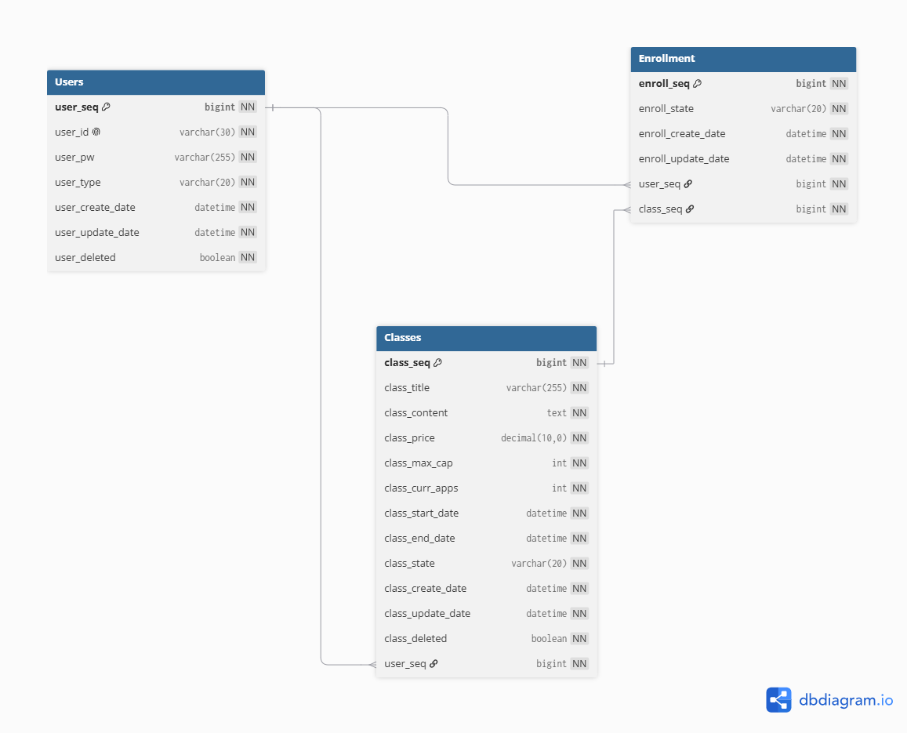

# 🎓 수강 신청 시스템 (Enrollment System)

## 📌 프로젝트 개요

수강 신청 시스템은 사용자가 강의를 조회하고 신청 및 관리할 수 있는 웹 서비스입니다.

동시 요청이 집중되는 수강 신청 환경을 가정하여 인증/인가, 동시성 제어, 비동기 메시지 처리 구조를 설계하고 구현했습니다.

비관적 락 기반 동시성 제어의 한계를 확인한 후 Kafka Consumer Group 기반 비동기 처리 구조를 적용했으며, JMeter 부하 테스트를 통해 성능 개선과 데이터 정합성을 검증했습니다.

---

## 🎯 주요 기능

- 회원가입 및 로그인
- JWT 기반 인증/인가
- 강의 목록 및 상세 조회
- 수강 신청 및 취소
- 신청 인원 제한 검증
- 중복 신청 방지
- Kafka 기반 비동기 수강 신청 처리

---

## 🏗️ 시스템 구조

### 수강 신청 처리 흐름

```text
사용자 요청
    ↓
Kafka Producer
    ↓
Topic (enrollment-request)
    ↓
Kafka Consumer Group
    ↓
수강 신청 처리
    ↓
DB 저장
```

Kafka Producer가 수강 신청 요청을 Topic에 발행하고, Consumer Group이 비동기 처리하도록 구성하여 요청 수신과 비즈니스 로직을 분리했습니다.

---

## 🗄️ 데이터베이스 설계



### 테이블 구성

- `Users`: 사용자 계정 및 권한 정보 관리
- `Classes`: 강의 정보, 정원 및 현재 신청 인원 관리
- `Enrollment`: 사용자와 강의 간 수강 신청 정보 관리

### 주요 관계

- 한 명의 강사는 여러 강의를 생성할 수 있습니다.
- 한 명의 사용자는 여러 강의를 신청할 수 있습니다.
- 하나의 강의에는 여러 사용자가 신청할 수 있습니다.
- `Enrollment` 테이블을 통해 사용자와 강의의 다대다 관계를 관리합니다.
- `(user_seq, class_seq)` 복합 UNIQUE 제약조건으로 중복 신청을 방지합니다.

---

## 🚀 Kafka 기반 비동기 처리

초기에는 비관적 락을 활용해 동시성 제어를 적용했지만, 요청 증가 시 데이터베이스 락 경합으로 처리 지연이 발생할 수 있음을 확인했습니다.

이를 개선하기 위해 Kafka Consumer Group 기반 비동기 처리 구조를 적용하여 요청 처리와 수강 신청 로직을 분리하고, 파티션과 Consumer를 활용한 병렬 처리 구조를 구성했습니다.

### 적용 효과

- 요청 처리와 비즈니스 로직 분리
- Consumer Group 기반 병렬 처리
- 데이터베이스 락 경합 감소
- 동시 요청 환경에서 데이터 정합성 확보
- 확장 가능한 메시지 기반 처리 구조 적용

---

## 🔐 인증 및 데이터 관리

- Spring Security + JWT 기반 인증/인가
- JWT Filter 기반 인증 처리
- Stateless 인증 구조
- Redis TTL 기반 인증 데이터 관리
- EntityGraph를 활용한 N+1 문제 사전 방지

---

## 📈 부하 테스트

Docker 환경에서 Kafka, MySQL, 애플리케이션을 구성한 뒤 JMeter를 활용해 최대 **1,000건 동시 요청** 환경에서 성능을 검증했습니다.

### 테스트 시나리오

- 회원가입
- 로그인 및 JWT 발급
- 수강 신청 요청
- 최대 1,000건 동시 요청

### Consumer Group 성능 비교

| 항목 | Partitions 1 / Concurrency 1 | Partitions 3 / Concurrency 3 |
|------|-----------------------------:|-----------------------------:|
| 평균 응답 시간 | 1,389ms | 206ms |
| 처리량 | 373.41 req/s | 637.76 req/s |
| 오류율 | 0% | 0% |
| Consumer End-to-End | 5.9~8.5초 | 4.6~7.1초 |
| 데이터 정합성 | 유지 | 유지 |

### 결과

- Partitions·Concurrency를 **1→3**으로 확장하여 **응답 시간 약 85% 감소**
- 처리량 **373.41 → 637.76 req/s (약 71% 향상)**
- 최대 **1,000건 동시 요청** 환경에서 **오류율 0%**
- **정원 초과 신청 0건**
- **중복 신청 0건**
- **데이터 정합성 유지**

---

## 🛠️ 기술 스택

### Backend

- Java 17
- Spring Boot
- Spring Security
- Spring Data JPA
- JWT

### Database

- MySQL
- Redis

### Message Queue

- Apache Kafka

### Infra & Test

- Docker
- JMeter

---

## 📄 문서

- API 명세서: [API-DESC.md](./docs/API-DESC.md)
- DB 설계: [DB-SCHEMA.md](./docs/DB-SCHEMA.md)
