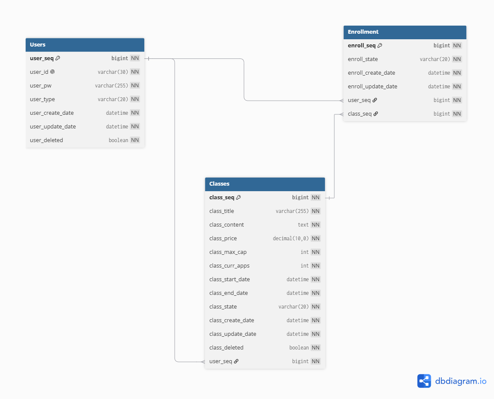

# 🎓 Enrollment System

동시 요청이 집중되는 수강 신청 환경에서 **정원 초과와 중복 신청을 방지하고, Kafka 장애 및 메시지 재전달 상황에서도 데이터 정합성을 유지하도록 구현한 수강 신청 시스템**입니다.

Spring Boot와 MySQL을 기반으로 개발했으며, Kafka를 이용해 수강 신청 요청과 실제 처리 로직을 비동기로 분리했습니다.

---

## 🛠 Tech Stack

| 구분 | 기술 |
|---|---|
| Backend | Java 17, Spring Boot 3.3.5, Spring Data JPA |
| Security | Spring Security, JWT |
| Database | MySQL 8, Redis |
| Message Queue | Apache Kafka |
| Test | JUnit 5, Testcontainers, Awaitility, JMeter |
| Infrastructure | Docker, AWS EC2 |
| CI/CD | GitHub Actions |

---

## 🗂 ERD



---

## 1. Kafka 기반 비동기 수강 신청

```text
Client
  ↓
Spring Boot API
  ↓
Kafka Producer
  ↓
enrollment-request
  ↓
Kafka Consumer
  ↓
EnrollService
  ↓
MySQL
```

수강 신청 API는 요청을 Kafka에 전달한 뒤 **HTTP 202 Accepted**를 반환하고 실제 신청 처리는 Consumer에서 비동기로 진행합니다.

- Partition: 3
- Consumer Concurrency: 3
- Message Key: `classSeq`

---

## 2. 동시성 제어

초기 비관적 락 방식은 동시 요청 증가 시 동일 강의 row에 대한 락 경쟁이 발생했습니다.

이를 **조건부 UPDATE** 방식으로 변경했습니다.

```sql
UPDATE classes
SET class_curr_apps = class_curr_apps + 1
WHERE class_seq = ?
  AND class_deleted = false
  AND class_state = 'OPEN'
  AND class_curr_apps < class_max_cap;
```

UPDATE 결과가 `1`이면 정원 확보 성공, `0`이면 정원 초과로 처리합니다.

신청 인원 증가와 수강 신청 데이터 저장은 동일한 트랜잭션에서 처리합니다.

---

## 3. 중복 신청 및 멱등성

동일 사용자의 동일 강의 중복 신청을 방지하기 위해 애플리케이션 검증과 DB UNIQUE 제약조건을 함께 사용합니다.

```java
@UniqueConstraint(
    name = "uq_enrollment_user_class",
    columnNames = {"user_seq", "class_seq"}
)
```

Kafka에서 동일 메시지가 재전달되더라도 첫 번째 요청만 반영되고 이후 요청은 중복 신청으로 처리됩니다.

### 멱등성 검증

동일 Kafka 이벤트를 두 번 발행해 다음 결과를 확인했습니다.

| 항목 | 결과 |
|---|---:|
| Kafka 메시지 전달 | 2회 |
| 실제 신청 데이터 | 1건 |
| 신청 인원 증가 | 1명 |

---

## 4. Kafka Retry & DLT

Consumer 처리 중 DB 연결 장애 등의 시스템 예외가 발생하면 재시도합니다.

```java
new FixedBackOff(1000L, 2L);
```

```text
최초 처리
→ 재시도
→ 재시도
→ DLT
```

최초 처리 포함 최대 3회 실패하면 메시지를 `enrollment-request-dlt`로 이동시킵니다.

중복 신청이나 정원 초과 같은 `BusinessException`은 재시도하지 않고, 시스템 예외만 Retry 대상으로 처리합니다.

---

## 5. 테스트

MySQL과 Kafka를 Testcontainers로 실행하여 실제 환경에 가까운 조건에서 검증했습니다.

### 동시성 테스트

정원 100명인 강의에 200명이 동시에 신청합니다.

| 항목 | 결과 |
|---|---:|
| 신청 성공 | 100건 |
| 정원 초과 | 100건 |
| 실제 신청 데이터 | 100건 |
| 현재 신청 인원 | 100명 |

동일 사용자가 같은 강의에 20번 동시에 신청하는 경우도 검증했습니다.

| 항목 | 결과 |
|---|---:|
| 신청 성공 | 1건 |
| 중복 신청 | 19건 |
| 실제 신청 데이터 | 1건 |

### Kafka 통합 테스트

- 동일 메시지 재전달 시 DB 반영 1회 검증
- 일시적 장애 발생 시 Retry 후 성공 검증
- 재시도 실패 시 DLT 전달 검증

---

## 6. 성능 테스트

JMeter를 이용해 Kafka Partition과 Consumer Concurrency 확장 전후를 비교했습니다.

| 구성 | 평균 응답시간 | 처리량 |
|---|---:|---:|
| Partition 1 / Concurrency 1 | 1,389 ms | 373.41 req/s |
| Partition 3 / Concurrency 3 | 206 ms | 637.76 req/s |

> 비동기 API의 HTTP 요청 접수 시간 기준입니다.

---

## 7. CI/CD

GitHub Actions를 이용해 테스트와 배포를 자동화했습니다.

```text
Pull Request
→ Gradle Test

main Push
→ Build
→ Docker Image Build
→ Docker Hub
→ AWS EC2
→ Docker Compose 배포
```

---

## 📄 문서

- [API 명세서](./docs/API-DESC.md)
- [DB 스키마](./docs/DB-SCHEMA.md)
- [JMeter 테스트 계획](./jmeter/test-plan.md)
